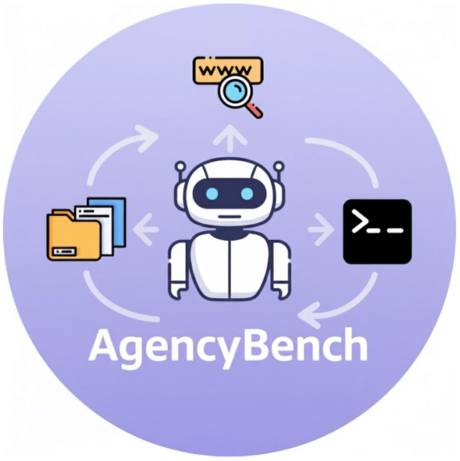
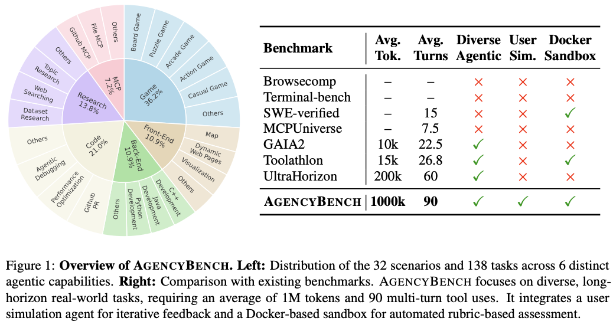
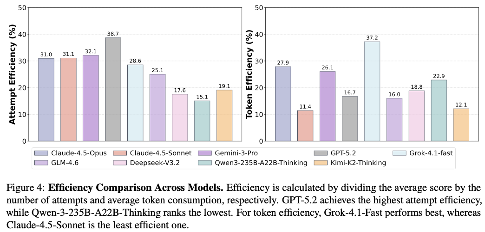
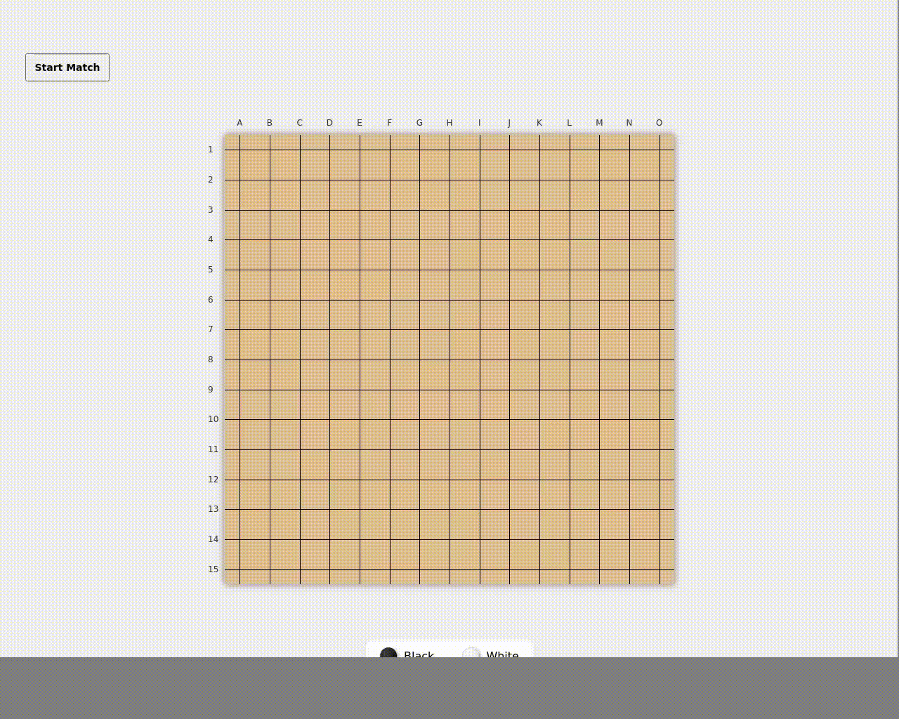
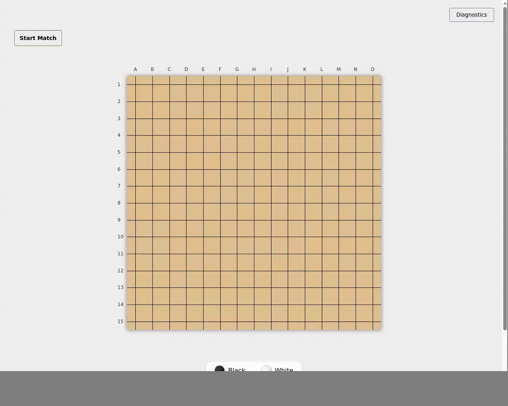

<div align="center">




# AgencyBench: Benchmarking the Frontiers of Autonomous Agents in 1M-Token Real-World Contexts

[](https://agencybench.opensii.ai)
[](https://arxiv.org/abs/2601.11044)
[](https://huggingface.co/datasets/GAIR/AgencyBench)
[](LICENSE)
[](https://github.com/GAIR-NLP/AgencyBench/stargazers)

</div>


## Abstract

Large Language Models (LLMs) based autonomous agents demonstrate multifaceted capabilities to contribute substantially to economic production. However, existing benchmarks remain focused on single agentic capability, failing to capture long-horizon real-world scenarios. Moreover, the reliance on human-in-the-loop feedback for realistic tasks creates a scalability bottleneck, hindering automated rollout collection and evaluation. To bridge this gap, we introduce **AgencyBench**, a comprehensive benchmark derived from daily AI usage, evaluating **6 core agentic capabilities** across **32 real-world scenarios**, comprising **138 tasks** with specific queries, deliverables, and rubrics. These scenarios require an average of **90 tool calls**, **1 million tokens**, and hours of execution time to resolve. To enable automated evaluation, we employ a user simulation agent to provide iterative feedback, and a Docker sandbox to conduct visual and functional rubric-based assessment. Experiments reveal that closed-source models significantly outperform open-source models (48.4% vs 32.1%). Further analysis reveals significant disparities across models in resource efficiency, feedback-driven self-correction, and specific tool-use preferences. Finally, we investigate the impact of agentic scaffolds, observing that proprietary models demonstrate superior performance within their native ecosystems, while open-source models exhibit distinct performance peaks, suggesting potential optimization for specific execution frameworks.

<p align="center">
  
</p>

## 🔥 Recent News

- **[2026/01]** 🚀 Open-sourced **AgencyBench-V2** with website and paper, containing 6 agentic capabilities, 32 real-world long-horizon scenarios and 138 apecific tasks, with detailed queries, rubrics, deliverables and evaluation scripts.

- **[2025/09]** 🎺 Open-sourced **AgencyBench-V1** with 10 tasks.


## ✨ Why AgencyBench?

AgencyBench targets **frontiers of autonomous agents** by focusing on **real-world, long-horizon** workflows:

- **Long context & long horizon**: tasks often require ~**1M tokens** and ~**90** tool calls with hours of execution.
- **Diverse capabilities**: covers 6 core agentic capabilities spanning **Game / Frontend / Backend / Code / Research / MCP**.
- **Automated evaluation at scale**: combines a **user simulation agent** (iterative feedback) with a **Docker sandbox** (visual + functional rubric checks).
- **Rubric-based scoring**: integrates **rule-based judges**, **vision-based judges**, and **LLM-as-judge** where appropriate.


<p align="center">
  
</p>

<p align="center">
  
</p>

For tasks that previously relied heavily on human evaluation—especially UI-centric Frontend workloads and interactive Game development—we run a Docker-based remote VM sandbox and follow a rubric-driven evaluation procedure to **make the evaluation process fully automated and visualizable**. When launching the evaluation script, the system automatically boots the remote VM and renders it locally, then opens the locally generated deliverables (e.g., frontend code) in the remote browser. The script proceeds to execute human-like tools and actions—mouse clicks, keyboard input, command-line operations, screenshots, and screen recording—while saving and syncing the evaluation artifacts back to the local machine.

<p align="center">
  
</p>

<p align="center">
  
</p>


## 🚀 Getting Started

### 1) Environment Setup

Create a conda environment and install Python dependencies:

```bash
conda create -n agencybench python=3.11
conda activate agencybench
pip install -r requirements.txt
```

### 2) Start the Docker Sandbox (Game + Frontend)

Game and Frontend scenarios rely on a Docker-based remote sandbox for UI/visual evaluation:

```bash
docker run --security-opt seccomp=unconfined --rm -it -p 8080:8080 ghcr.io/agent-infra/sandbox:latest
```

Make sure the scenario `.env` contains `SANDBOX_BASE_URL=http://localhost:8080`.

### 3) Run a Scenario

1. Enter a scenario folder (e.g., `Backend/scenario1`).
2. Fill out the scenario `.env` (scaffold config + evaluated model API config + text/vision evaluator model config + other hyperparameter config).
3. Set environment variables and run the evaluation script:

```bash
cd Backend/scenario1
source .env
python eval_task.py
```

Optional: use `python eval_task.py --visualize` to watch the automated evaluation process (game and frontend: mouse events, screen interactions, screenshots, ...).

### 4) Outputs

Running `eval_task.py` creates a **model-named run directory** inside the scenario folder (derived from `SII_TARGET_MODEL`). The directory contains intermediate artifacts and a final `meta_eval.json` that records the evaluation details and score.

Each scenario includes a `claude/` folder with a sample `meta_eval.json` as a reference.


## 🏗️ Project Structure

```
AgencyBench-v2/
├── Backend/
│   └── scenario*/
│       ├── .env
│       ├── description.json
│       ├── eval_task.py
│       └── claude/meta_eval.json
├── Code/
│   └── scenario*/
│       ├── .env
│       ├── description.json
│       ├── eval_task.py
│       └── claude/meta_eval.json
├── Frontend/
│   └── scenario*/
│       ├── .env
│       ├── description.json
│       ├── eval_task.py
│       └── claude/meta_eval.json
├── Game/
│   └── scenario*/
│       ├── .env
│       ├── description.json
│       ├── eval_task.py
│       └── claude/meta_eval.json
├── Research/
│   └── scenario*/
│       ├── .env
│       ├── description.json
│       ├── eval_task.py
│       └── claude/meta_eval.json
├── MCP/
│   └── scenario*/
│       ├── .env
│       ├── description.json
│       ├── eval_task.py
│       └── claude/meta_eval.json
├── assets/                # Logos and paper figures used by this README
├── AgencyBench_v2_0.pdf   # Paper PDF (v2.0)
├── requirements.txt       # Python dependencies
└── README_ref.md          # README formatting reference
```

Each `*/scenario*/` folder contains:

- `.env`: scenario configuration (scaffold + API + evaluator keys, sandbox URL, attempt limits, etc.).
- `description.json`: task specification (subtasks, deliverables, rubrics).
- `eval_task.py`: runner that performs rollout + automated evaluation and writes `meta_eval.json`.
- `workspace/` (when present): a clean template workspace copied into the model run directory.
- `claude/`: a **demo run** containing `meta_eval.json` as an example.

## 📚 Scenarios Overview

### Back-end Development (3)

- `Backend/scenario1`: Build a C++ console chat app with auth, friends, chat history/search, and concurrency-safe messaging.
- `Backend/scenario2`: Build a Java CLI task manager with per-user persistence, filtering/search, archiving, and concurrency-safe storage.
- `Backend/scenario3`: Build a Python systems pipeline (event generator, transactional KV store, orchestrator, planner, self-repair).

### Code Development / Debugging (9)

- `Code/scenario1`: Fit interpretable reaction-rate equations by editing `equation.py` and minimizing MSE on provided data.
- `Code/scenario2`: Improve docs and add Qdrant vector-store support, plus ChromaDB compatibility fixes and CI updates.
- `Code/scenario3`: Improve docs and add Qdrant vector-store support, plus ChromaDB compatibility fixes and CI updates.
- `Code/scenario4`: Build a math-reasoning pipeline across graph/geometry/convexity datasets using solvers + GPT-4o explanations.
- `Code/scenario5`: Implement a deep-research agent scaffold (planning, search, evidence, synthesis) with strict model/tool contracts.
- `Code/scenario6`: Discover a scientific equation in a constrained workspace and report loss + formula in a strict JSON file.
- `Code/scenario7`: Discover a scientific equation in a constrained workspace and report loss + formula in a strict JSON file.
- `Code/scenario8`: Build a FastAPI + MongoDB GitHub webhook service with session tracking, event processing, and logging.
- `Code/scenario9`: Build a Docker-sandboxed code agent workflow (repo cloning, PR creation) plus a monitoring dashboard.

### Front-end Development (3)

- `Frontend/scenario1`: Build an interactive USA SVG map launch view with clickable states and evaluation-friendly DOM hooks.
- `Frontend/scenario2`: Build a responsive portrait “Square Fit” stage UI with strict layout constraints and visible target region.
- `Frontend/scenario3`: Build a 3D solar system landing view with synchronized 3D/2D panels and a planet menu.

### Game Development (10)

- `Game/scenario1`: Build a browser Gomoku game with move logic, win detection, replay, persistence, and diagnostics.
- `Game/scenario2`: Build a browser 2048 game with slide mechanics, scoring, win/loss logic, persistence, and diagnostics.
- `Game/scenario3`: Build a browser Snake game with keyboard controls, scoring, persistence, and evaluation diagnostics.
- `Game/scenario4`: Build a browser Tic-Tac-Toe game with turn logic, win detection, persistence, and diagnostics.
- `Game/scenario5`: Build a browser Minesweeper game with cell interaction, HUD, persistence, and evaluation diagnostics.
- `Game/scenario6`: Build a browser Lianliankan (tile matching) game with path rules, persistence, and diagnostics.
- `Game/scenario7`: Build a browser Jump-a-Jump game with press-to-charge controls, persistence, and diagnostics.
- `Game/scenario8`: Build a browser Flappy Bird game with physics, controls, persistence, and evaluation diagnostics.
- `Game/scenario9`: Build a browser Sudoku game with input tooling, puzzle handling, persistence, and diagnostics.
- `Game/scenario10`: Build a browser Fruit Ninja game with slicing interactions, scoring, persistence, and diagnostics.

### Deep Research (5)

- `Research/scenario1`: Discover datasets on Hugging Face, extract README + samples, and produce schema-validated metadata files.
- `Research/scenario2`: Answer multi-hop NBA identity questions with citations and produce a consolidated JSON verification report.
- `Research/scenario3`: Identify public-company targets via filings and comparisons, backed by citations and summary tables.
- `Research/scenario4`: Research “Chat vs Agent” with web evidence, write a structured report, and score via rubric recall.
- `Research/scenario5`: Research planning/simulation for agents with web evidence, write a structured report, and score via recall.

### Model Context Protocol (MCP) Tool Use (2)

- `MCP/scenario1`: Use GitHub MCP to create an issue/branch/PR and add a structured bug report issue template.
- `MCP/scenario2`: Reorganize a workspace by migrating `.py/.csv/.md` assets into a new hierarchy with strict rules and cleanup.


## ⭐ Star History

[](https://star-history.com/#GAIR-NLP/AgencyBench&Date)

## 📖 Citation

If you use AgencyBench in your research, please cite:

```bibtex
@article{li2026agencybench,
  title={AgencyBench: Benchmarking the Frontiers of Autonomous Agents in 1M-Token Real-World Contexts},
  author={Li, Keyu and Shi, Junhao and Xiao, Yang and Jiang, Mohan and Sun, Jie and Wu, Yunze and Xia, Shijie and Cai, Xiaojie and Xu, Tianze and Si, Weiye and others},
  journal={arXiv preprint arXiv:2601.11044},
  year={2026}
}
```
